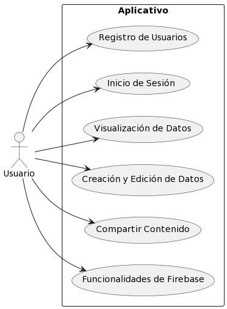

# ASIGNACION 3 (PROGRAMACION MOVIL)

## - ENTORNO DESARROLLO 

#### 1. Lenguaje de programación: Kotlin

- **Descripción:** Kotlin es un lenguaje de programación moderno que se utiliza para desarrollar aplicaciones para Android. Combina características de lenguajes como Java y ofrece mejoras en cuanto a concisión y seguridad.
- **Proceso de instalación:** Kotlin se integra directamente en Android Studio, por lo que no requiere una instalación separada. Para utilizar Kotlin en VSCode, debes instalar la extensión "Kotlin Language".

### 2. Entorno de desarrollo integrado (IDE): Android Studio

- **Descripción:** Android Studio es el IDE oficial de desarrollo de Android. Proporciona un conjunto completo de herramientas y características para desarrollar aplicaciones de Android, incluyendo la edición de código, el diseño de interfaces de usuario, la depuración y la compilación.
- **Proceso de instalación:** 
  - Ve al sitio web oficial de Android Studio: https://developer.android.com/studio.
  - Descarga la versión adecuada para tu sistema operativo.
  - Ejecuta el instalador y sigue las instrucciones en pantalla.

### 3. Kit de desarrollo de software (SDK): Android SDK 33

- **Descripción:** El Android SDK proporciona herramientas, bibliotecas y APIs necesarias para desarrollar aplicaciones para Android. La versión 33 se refiere a la versión del SDK correspondiente a la API nivel 33 de Android.
- **Proceso de instalación:** El SDK se descargará automáticamente durante la configuración inicial de Android Studio. Si necesitas instalar una versión específica del SDK, puedes hacerlo a través del "Android SDK Manager" en Android Studio.

### 4. Marcos y bibliotecas: Jetpack Compose y Retrofit

- **Jetpack Compose:** Es un moderno toolkit de UI declarativo para Android. Simplifica la construcción de interfaces de usuario nativas de Android mediante la composición de componentes.
- **Retrofit:** Es una biblioteca para realizar solicitudes de red y manejar respuestas en aplicaciones Android.
- **Proceso de instalación:** Estas bibliotecas se pueden agregar como dependencias en el archivo de configuración `build.gradle` del proyecto.

### 5. Sistema de control de versiones (VCS): Git

- **Descripción:** Git es un sistema de control de versiones ampliamente utilizado en el desarrollo de software. Permite realizar un seguimiento de los cambios en el código fuente, colaborar con otros desarrolladores y administrar diferentes ramas de desarrollo.
- **Proceso de instalación:** Descarga Git desde el sitio web oficial: https://git-scm.com/downloads. Ejecuta el instalador y sigue las instrucciones en pantalla.

### 6. Emuladores y dispositivos: Pixel_3a_API_33_x86_64

- **Descripción:** Los emuladores y dispositivos se utilizan para probar y depurar aplicaciones Android durante el desarrollo. "Pixel_3a_API_33_x86_64" se refiere a un emulador que simula un dispositivo Google Pixel 3a con API nivel 33 y arquitectura x86_64.
- **Proceso de instalación:** Crea el emulador desde el "Administrador de Dispositivos Virtuales" en Android Studio.

### 7. Documentación y recursos:

- Android: https://developer.android.com
- Kotlin: https://kotlinlang.org/docs/home.html
- GitHub: https://github.com
- Ionic: https://ionicframework.com/docs/intro/cli
- Node.js: https://nodejs.org/es/

## - DIAGRAMA DESPLIEGUE 

## - REQUERIMIENTOS NO FUNCIONALES DEL APLICATIVO MÓVIL

### 1. Usabilidad:
<!---- La aplicación móvil debe ser intuitiva y fácil de usar, con una interfaz de usuario clara y navegación fluida.
 -->
 - Utilizaremos Android con Kotlin SDK 33 junto con la herramienta Jetpack Compose para crear una interfaz amigable con el usuario.

### 2. Rendimiento:
  <!---- El aplicativo debe ser eficiente y responder rápidamente a las interacciones del usuario, evitando retrasos o bloqueos innecesarios.
 -->
  - Podemos monitorear utilizando Google Crashlytics y Analytics para identificar y solucionar problemas de rendimiento, así como realizar un seguimiento de métricas importantes como el tiempo de carga, la velocidad de respuesta y el consumo de recursos.

### 3. Seguridad:

  <!----  Garantizar la seguridad de los datos de los usuarios, utilizando técnicas adecuadas de cifrado y protección de información confidencial.
    -->
- Aplicaremos técnicas adecuadas de cifrado. Además, Google Crashlytics y Analytics también pueden proporcionar información valiosa sobre posibles problemas de seguridad y brechas en nuestra aplicación móvil.

### 4. Compatibilidad:

  <!----  - La aplicación móvil debe ser compatible con diferentes versiones de sistemas operativos móviles, como Android y iOS, según los requisitos del proyecto.  -->

   - El SDK 33 de Android proporciona compatibilidad hacia atrás y hacia adelante, permitiendo que la aplicación se ejecute en una amplia gama de dispositivos Android.

### 5. Escalabilidad:
 <!----  - La arquitectura y diseño de la aplicación móvil deben permitir su escalabilidad para manejar un aumento en el número de usuarios y el volumen de datos. -->

- El servidor de backend, desarrollado con Node.js, junto con la base de datos local SQLite3, se puede diseñar y configurar para garantizar la escalabilidad.

- Node.js es conocido por su capacidad de manejar múltiples conexiones simultáneas y escalabilidad horizontal.
- SQLite3 puede ser utilizado como una base de datos local eficiente para almacenar y administrar datos en la aplicación móvil.

### 6. Conectividad:

   <!---- El aplicativo móvil debe funcionar tanto en conexiones de red estables como en conexiones de red limitadas o intermitentes, proporcionando una experiencia óptima en ambas situaciones. -->

- El uso de la biblioteca Retrofit en la aplicación móvil permitirá manejar solicitudes y respuestas de red de manera eficiente y tener control sobre la conectividad.

### 7. Internacionalización:

- El SDK 33 de Android se puede adaptar a diferentes idiomas y regiones. Adicionalmente,
RepIt.it puede ayudar en la gestión de los recursos de idioma y traducción de la interfaz de usuario.

## REQUERIMIENTO FUNCINALES DEL APLICATIVO MÓVIL:

### 1. Registro de Usuarios:
   - Los usuarios deben poder registrarse en la aplicación móvil proporcionando información como nombre, correo electrónico y contraseña.

 -El usuario ingresa su información de registro, la aplicación valida y almacena los datos del usuario en la base de datos.

### 2. Inicio de Sesión:
   - Los usuarios registrados deben poder iniciar sesión en la aplicación móvil utilizando sus credenciales de inicio de sesión.

- El usuario ingresa sus credenciales de inicio de sesión, la aplicación verifica la autenticidad y permite el acceso al perfil del usuario.

### 3. Visualización de Datos:
   - La aplicación debe mostrar datos almacenados en la base de datos de Firebase, como listas de productos, publicaciones, mensajes, etc.
- El usuario accede a la sección correspondiente en la aplicación y visualiza los datos disponibles.
### 4. Creación y Edición de Datos:
   - Los usuarios deben poder crear nuevos registros o editar registros existentes en la base de datos, como agregar productos o crear publicaciones.
- El usuario accede a la funcionalidad de creación o edición, proporciona la información requerida y la aplicación actualiza la base de datos. 

### 5. Compartir Contenido:
   - Los usuarios deben tener la opción de compartir contenido de la aplicación a través de  correo electrónico.

- El usuario selecciona la opción de compartir, elige la plataforma deseada y la aplicación comparte el contenido seleccionado a través de esa plataforma.

### 6. Funcionalidades de Firebase:

   - Aprovechar las funcionalidades de Firebase, como la autenticación de usuarios, almacenamiento en la nube, análisis.
- La aplicación utiliza las diversas funcionalidades de Firebase, como la autenticación para gestionar la identificación de usuarios, el almacenamiento en la nube para guardar y recuperar datos, y el análisis para obtener información sobre el uso de la aplicación.

## - DIAGRAMA DE CASO DE USO 

## 